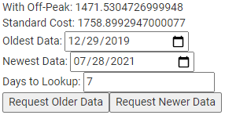

# ElectricEstimate
An easier method to compare two electric rate plans with Alliant Energy.

## Data Retrieval Considerations
1) Hourly day is available in 24 hour chunks
2) I don't know if I'm rate limited (IE: I'll try not to spam requests, or repeat requests by caching historical data)
3) No offical API identified for data export

## GUI
* Cost based on usage using Off-Peak rates
* Cost based on usage using flat rate
* Oldest loaded data 
* Newest loaded data 
* Number of days to lookup data for
* Requesting older data starts at oldest data day
* Requesting newer data starts at newest data day

# Background
1) Alliant provider allows me to choose how I pay for electricity between "fixed rate" and "off-peak variable rates".
2) Locked into the rate plan for 12 months. 
3) No guarantees that switching has reduced costs. I may receive a discount *OR* I pay more.
 
## Assumptions
1) Next years usage will closely follow this year.
2) There was a pandemic and I've been home more than ever before during peak hours. This means future data (should) be a larger gap.

## Energy pricing periods
* **High rate**: (Summer = Jun. Jul. Aug.)
* * 11 a.m. to 7 p.m.
* **High rate**: (Winter = Dec. Jan. Feb.)
* * 5 p.m. to 9 p.m.
* **Low rate**: 11 p.m. to 6 a.m. weeknights
* **Low rate**: All hours on weekends and holidays
* Regular rate: All other hours

## Seasonal

|  | Rg-1 Residential | Rg-5 Residential | Rd-1 Residential  |
| - | -------------- | ---------------- | ------------- |
| $/kWh | Default Flat | Time-Of-Use | Demand rate  + Time-of-Use |
| All kWh |	0.13091      |                  |               |
| High rate |            | 0.19600          | 0.17520       |
| Regular rate |         | 0.16300          | 0.13400       |
| Low rate |             | 0.07900          | 0.07100       |

